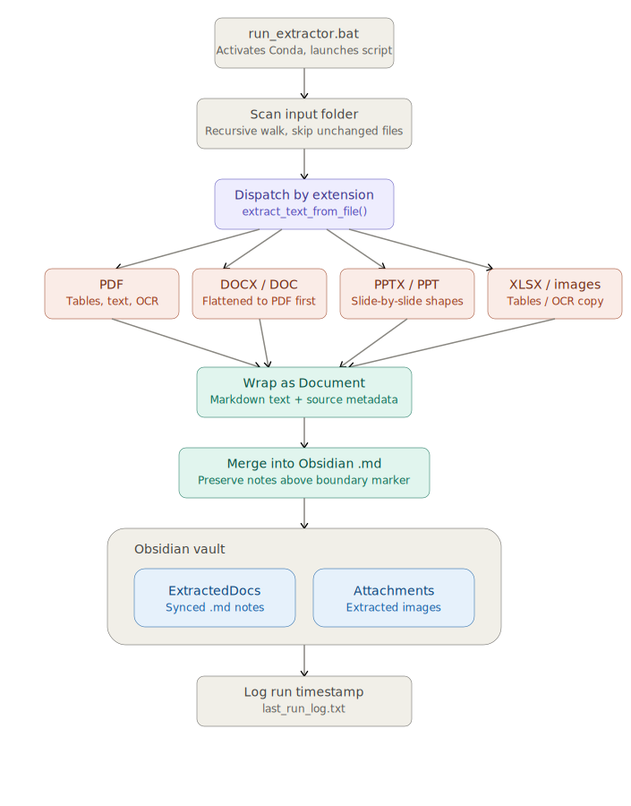

# MarkdownWala: Universal Document-to-Obsidian Extractor

An automated, cross-format data ingestion pipeline that transforms unstructured documents (PDFs, PowerPoints, Word documents, Excel, and Images) into clean, structured Markdown. 

Designed specifically to feed personal knowledge management (PKM) systems like Obsidian and serve as a robust data-cleaning step for Retrieval-Augmented Generation (RAG) applications.

## 🚀 Key Features

* **Hybrid PDF Engine:** Combines PyMuPDF and pdfplumber to extract standard text, intelligently parse tables into Markdown format, and extract embedded images.
* **Smart OCR Fallback:** Uses Tesseract OCR automatically when it detects scanned, image-only PDF pages.
* **Native PowerPoint Extraction:** Recursively parses `.pptx` files slide-by-slide, extracting text, embedded tables, and images (even if they are grouped).
* **Word Document Handling:** Converts `.docx` files to PDF on-the-fly to ensure SmartArt and complex diagrams are accurately captured before text extraction.
* **Non-Destructive Sync:** Safely syncs extractions to your Obsidian vault. It uses a `## 🤖 Auto-Extracted Content` boundary marker to ensure your personal, handwritten notes at the top of the file are never overwritten.

## 🛠️ Prerequisites

Before running the script, ensure you have the following installed on your system:
1. **Python 3.8+** and **Anaconda** environment ( I am using 3.12.3 )
2. **Tesseract OCR:** 
   * **Windows:** Download and install from [UB-Mannheim's GitHub](https://github.com/UB-Mannheim/tesseract/wiki). Make note of the installation path (usually `C:\Program Files\Tesseract-OCR\tesseract.exe`).
   * **Mac/Linux:** `brew install tesseract` or `sudo apt-get install tesseract-ocr`.
3. **Microsoft Word (Optional):** Required only if you want to use the on-the-fly `.docx` flattening feature.
4. **Obsidian**


## ⚙️ Installation & Setup

**1. Clone the repository**
```bash
git clone https://github.com/rohan2399/MarkdownWala.git
cd MarkdownWala
```
**1. Install dependencies** in a new environment
**2. Run the program** by executing the .bat or .sh file once. It will create NormalFolder.

🏃‍♂️**How to Use**

1. Drop your raw files (.pdf, .pptx, .docx, .xlsx, .jpg, etc.) into the NormalFolder directory.

2. Run the extraction pipeline:

Windows Users: Simply double-click run_extractor.bat.
Command Line: Run python uploadermd.py. or  run_extractor.sh.

Open the ObsidianVault/ExtractedDocs folder in Obsidian to view your perfectly formatted Markdown files and attachments!
(You need to manually open Obsidian and open the folder there which would connect them by a .obsidian folder.

## Workflow Diagram

